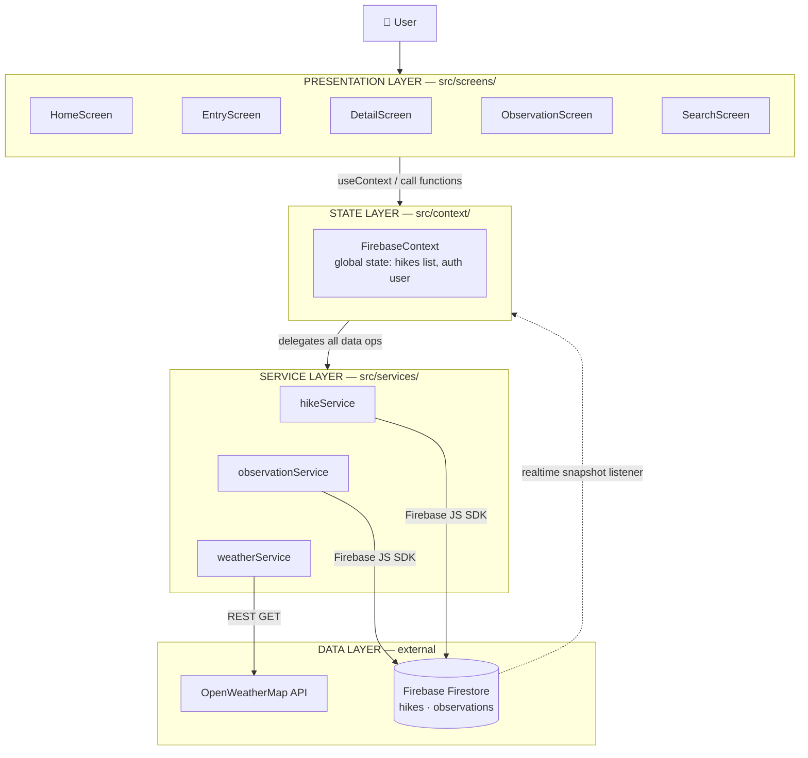

# M-Hike 🥾

A hiker management app — record planned hikes, log observations during a hike, and search your records. Data lives in the cloud so hikes are shared with the community.

Coursework for **COMP1786 — Mobile Application Design and Development** (University of Greenwich, 2025/26).

**Tech:** React Native (Expo) · Firebase Firestore · Firebase Anonymous Auth · React Navigation · OpenWeatherMap API

> This repo is a monorepo. `react-native-app/` implements coursework features e–g. `android-app/` (native Java, features a–d) is added in phase 2.

---

## Features

- ✏️ **Add hike** — required fields (name, location, date, parking, length, difficulty) + optional (description, estimated duration, terrain type), inline validation, confirmation screen before save *(feature e)*
- 📋 **Manage hikes** — list, view details, edit, delete one, reset all (with confirm dialog) *(feature f)*
- 🔭 **Observations** — add time-stamped observations to any hike, edit/delete, default time = now
- 🔎 **Search** — by name, plus advanced filters (location, length, date)
- 📍 **Location + weather** *(feature g)* — auto-capture GPS coordinates on each observation and attach current weather from OpenWeatherMap
- 📶 **Offline-first** — works without a network (Firestore local cache), syncs automatically when back online

## Screenshots

UI designs live in [`design/`](design/). Key screens:

| Home | Add Hike | Observations |
|---|---|---|
|  |  |  |

---

## Architecture

Layered architecture with a strict one-way dependency flow. Each layer only talks to the layer directly below it.



### Layer responsibilities

| Layer | Location | Does | Never does |
|---|---|---|---|
| **Presentation** | `src/screens/`, `src/components/` | Render UI, collect input, client-side validation, navigation | Touch Firestore or fetch APIs directly; hold business logic |
| **State** | `src/context/FirebaseContext.js` | Hold global observable state (hikes list, auth user); expose actions to screens; subscribe to Firestore realtime updates | Render anything; contain query details |
| **Service** | `src/services/` | All CRUD/queries against Firestore; weather API calls; data mapping (doc ↔ JS object) | Know about React — plain JS modules, no hooks, no components |
| **Data** | Firebase / OpenWeatherMap | Store documents, enforce Security Rules, push realtime snapshots | — |

This mirrors MVVM: `FirebaseContext` plays the ViewModel role (observable state, no knowledge of views), screens play the View role (dumb rendering), services + Firestore are the Model. The phase-2 Android app implements the same shape literally: `Activity → ViewModel (LiveData) → Repository → Firestore`.

### Data flow — worked example: saving a hike

1. User fills the form on **EntryScreen**, taps *Continue* → screen validates required fields (inline errors if missing) → shows **ConfirmScreen**
2. User taps *Save Hike* → screen calls `addHike(hike)` obtained from `useContext(FirebaseContext)`
3. Context delegates to `hikeService.addHike()` → service stamps `userId` + `createdAt` and writes the document via the Firebase SDK
4. Firestore commits (or queues locally if offline) and fires the **snapshot listener** the Context registered at startup
5. Context updates its `hikes` state → every subscribed screen (Home, All Hikes) **re-renders automatically** — no manual refresh anywhere

The reverse path (delete, edit, reset) follows the same loop. One source of truth: the Firestore snapshot; screens never keep their own copy of the data.

### Design principles

- **Single source of truth** — UI state derives from the Firestore snapshot via Context; no duplicated lists.
- **Separation of concerns** — swap Firestore for another backend and only `src/services/` changes.
- **Offline-first** — writes go to the local cache first; sync is Firebase's job, not ours.
- **Security lives server-side** — client config is public by design; per-user write access is enforced by `firestore.rules`, not by hiding keys.

Full design record (SRS, ERD, decisions log, report notes): see [`CLAUDE.md`](CLAUDE.md).

---

## Getting started

### Prerequisites

- Node.js 18+ and npm
- **Expo Go** app on your phone (or an Android emulator)
- A Firebase project — follow [`SETUP_FIREBASE.md`](SETUP_FIREBASE.md) (one-time, ~10 min)
- An OpenWeatherMap API key (free tier) — see the same guide

### Run

```bash
cd react-native-app
npm install

# configure credentials (never committed):
cp src/services/firebaseConfig.example.js src/services/firebaseConfig.js
#   → paste your Firebase config values + OpenWeatherMap key into the new file

npx expo start        # scan the QR with Expo Go, or press 'a' for Android emulator
```

### Project structure

```
m-hike/
├── README.md                  # you are here
├── CLAUDE.md                  # full design doc / AI context
├── SETUP_FIREBASE.md          # backend setup guide
├── firestore.rules            # Firestore security rules (deploy via console)
├── design/                    # UI mockups (8 screens)
├── react-native-app/          # features e–g
│   ├── src/
│   │   ├── components/        # reusable UI parts
│   │   ├── screens/           # Home, Entry, Confirm, Detail, Observation, Search
│   │   ├── navigation/        # React Navigation setup
│   │   ├── context/           # FirebaseContext (state layer)
│   │   └── services/          # hikeService, observationService, weatherService, firebaseConfig
│   ├── App.js
│   └── package.json
└── android-app/               # phase 2 — native Java, features a–d
```

---

## Author

Long — COMP1786, University of Greenwich (partnership centre), 2025/26.