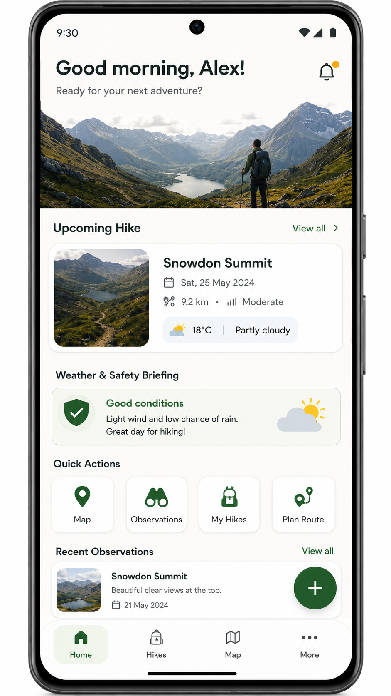
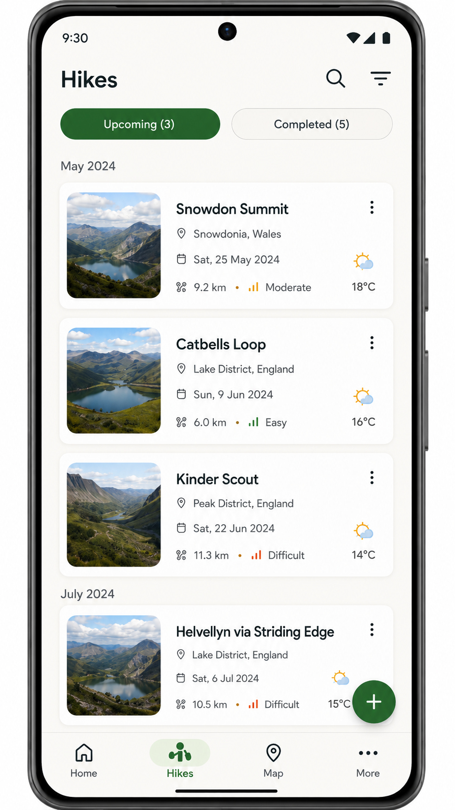
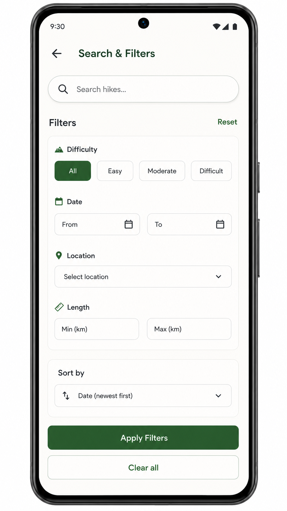
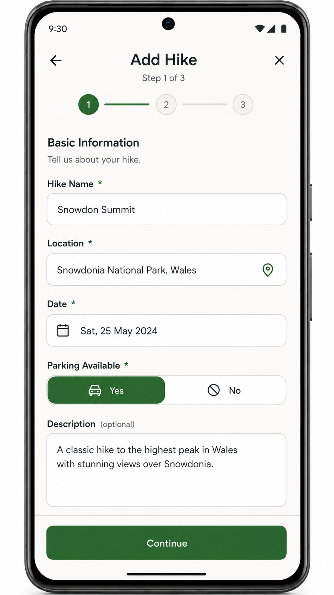
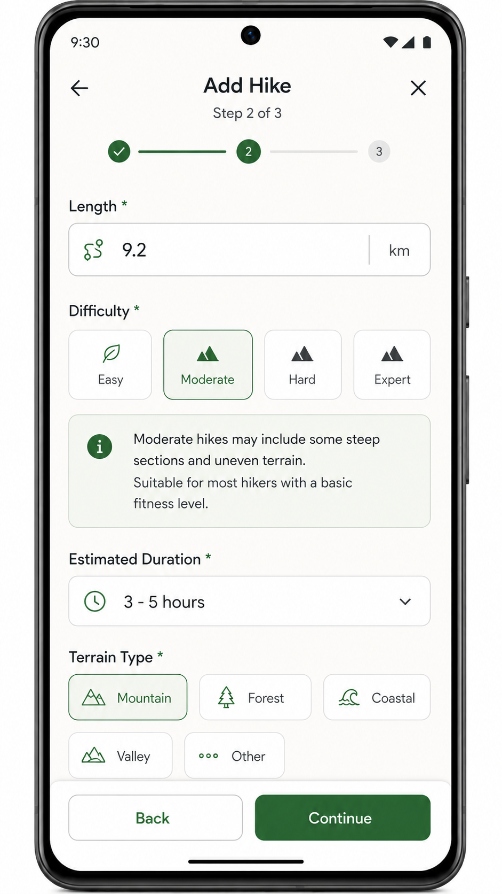
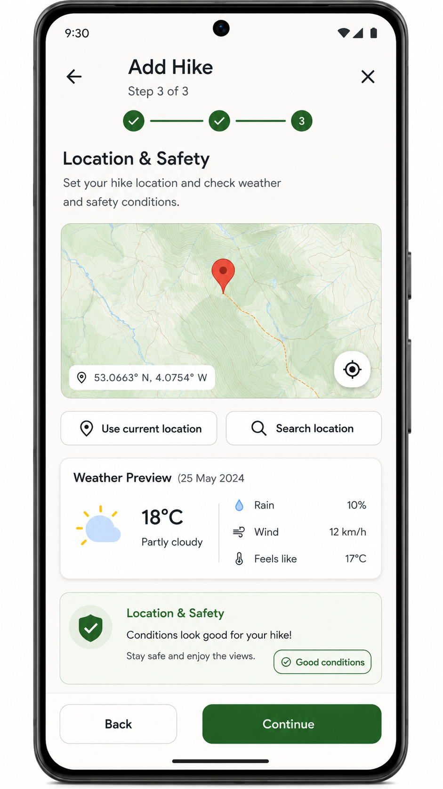
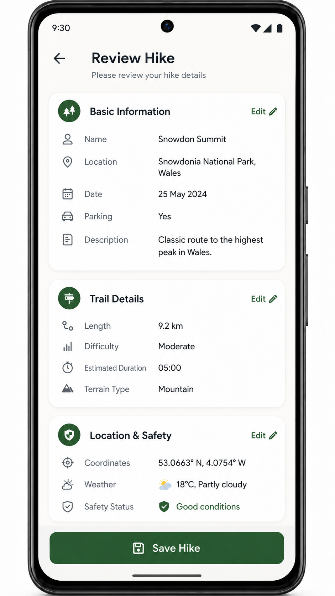
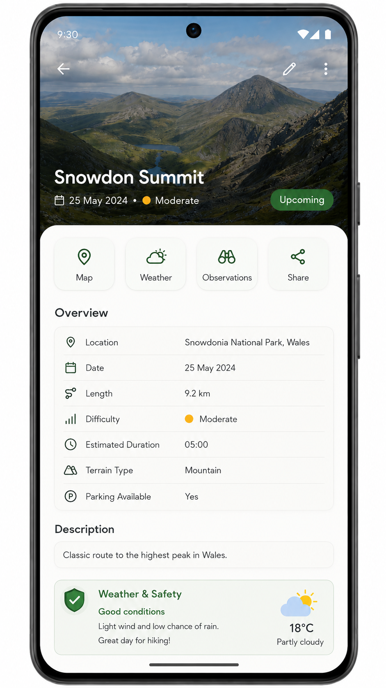

# M-Hike 🥾

A hiker management app — record planned hikes, log observations during a hike, and search your records. Data lives in the cloud (Firebase Firestore) so hikes are shared with the community.

Coursework for **COMP1786 — Mobile Application Design and Development** (University of Greenwich, 2025/26).

**Tech:** React Native (Expo SDK 57) · Firebase Firestore · Firebase Email/Password Auth · React Navigation · OpenWeatherMap API · Leaflet (via WebView, for the Map tab)

> This repo currently contains the React Native app only (coursework features e–g, which also cover the full functional scope a–d as the reference implementation). The native Android/Java port (features a–d) is a later phase and is not in this repo yet.

---

## Features

| # | Feature | Status |
|---|---|---|
| a | Enter hike details — required fields (name, location, date, parking, length, difficulty) + optional (description, estimated duration, terrain type), inline validation, confirmation screen before save | ✅ |
| b | List / view / **edit** / delete hikes, reset all (with confirm dialog) | ✅ |
| c | Observations — add time-stamped observations to any hike, edit/delete, multiple per hike, defaults to now | ✅ |
| d | Search by name (prefix match) + advanced filters (location, length, date range) | ✅ |
| e | Cross-platform prototype (this app) | ✅ |
| f | Cross-platform persistence via Firestore, realtime sync, offline-capable | ✅ |
| g | Automatic location capture + weather via OpenWeatherMap when adding a hike | ✅ |

### Known limitations (honest gaps, not yet done)

- Observations don't yet auto-capture location/weather themselves — only the **hike** entry does (feature g). The `observations` schema has `latitude`/`longitude`/`weather` fields reserved for this, but the Observation screen doesn't populate them yet.
- Tab screens (Home, Hikes, Map) stay mounted (not unmounted) when you switch tabs, per React Navigation's default bottom-tabs behavior — their Firestore listeners keep running in the background rather than fully detaching. Functionally harmless at this data scale, but doesn't fully meet the "detach listeners when not visible" battery guidance in the spec.
- Search filtering is done client-side over the full `hikes` snapshot (fine at hobby-project scale; wouldn't scale to a large shared dataset without server-side query filters).

---

## Screenshots

UI designs live in [`design/`](design/):

| Home | Hikes list | Search & Filters |
|---|---|---|
|  |  |  |

| Add Hike — Basic | Add Hike — Trail | Add Hike — Location |
|---|---|---|
|  |  |  |

| Review Hike | Hike Detail |
|---|---|
|  |  |

---

## Architecture

```
Screens (src/screens/)
   │  useContext() for auth state + the add/edit-hike wizard form
   │  calls service functions directly for all reads/writes
   ▼
Context (src/context/)
   FirebaseContext   — auth-state gate; exposes { uid, ready }
   HikeFormContext   — holds the 3-step Add/Edit Hike wizard form state
   ▼ (screens call services directly, not through context)
Services (src/services/)
   hikeService.js         — hikes CRUD + realtime subscribe
   observationService.js  — observations CRUD + realtime subscribe
   locationService.js     — expo-location wrapper
   weatherService.js      — OpenWeatherMap REST call
   firebaseConfig.js      — Firebase app/auth/firestore init (gitignored)
   ▼
Firebase Firestore (collections: hikes, observations) + OpenWeatherMap REST API
```

- **UI never calls Firestore directly** — every read/write goes through `src/services/`.
- **`FirebaseProvider` gates the whole app** on the initial auth check completing (`ready === true`) before rendering Login vs. the main app. This matters: screens subscribe to Firestore in `useEffect` on mount, and a listener that attaches before `request.auth` exists gets a one-time `permission-denied` from Security Rules that it never recovers from — gating avoids that race entirely.
- **Signed-out users see `AuthNavigator`** (Login/Register screens); signed-in users see the main tab navigator — `RootNavigator` branches on `uid` from `FirebaseContext`.
- **`HikeFormContext`** is shared by the Add-Hike wizard (`EntryBasic → EntryRoute → EntryLocation → Confirm`) and doubles as the Edit-Hike flow: `DetailScreen`'s Edit button calls `startEdit(hike)` to prefill the same form, and `ConfirmScreen` calls `updateHike()` instead of `addHike()` when an `editingHikeId` is present.
- Data model, Security Rules summary, and full design rationale: see [`CLAUDE.md`](CLAUDE.md). Rules live in [`firestore.rules`](firestore.rules) — **not auto-deployed**; paste into Firebase Console → Firestore Database → Rules → Publish after any change.

---

## Getting started

### Prerequisites

- Node.js 18+ and npm
- **Expo Go** app on your phone (or an Android/iOS emulator), or a browser for `expo start --web`
- A Firebase project with Firestore + Email/Password Auth enabled (Authentication → Sign-in method), with `firestore.rules` published
- An OpenWeatherMap API key (free tier)

### Run

```bash
npm install

# configure credentials (gitignored, never committed):
cp .env.example .env
#   → add EXPO_PUBLIC_OPENWEATHER_API_KEY to .env
# create src/services/firebaseConfig.js exporting `app`, `auth`, `db`
#   (see the shape in CLAUDE.md's Architecture section)

npx expo start        # scan the QR with Expo Go, press 'a' for Android, or 'w' for web
```

### Test accounts

Two demo accounts exist on the shared Firebase project for testing the Login/Register flow (each owns its own hikes/observations, per the Security Rules):

| Email | Password |
|---|---|
| hiker1@mhike.test | MHike#2026a |
| hiker2@mhike.test | MHike#2026b |

> Coursework demo credentials only — rotate or delete these before making the repo public.

### Project structure

```
MHikeRN/
├── README.md               # you are here
├── CLAUDE.md                # full design doc / SRS / AI context
├── firestore.rules          # Firestore security rules (deploy via console)
├── .env.example              # template for OpenWeatherMap API key
├── design/                   # UI mockups (8 screens + contact sheet)
├── assets/images/hikes/      # terrain stock photos (mountain/forest/coastal/valley/other)
├── App.js
├── index.js
└── src/
    ├── components/           # ScreenHeader, StepIndicator
    ├── screens/               # Home, Hikes, Detail, EntryBasic/Route/Location, Confirm,
    │                          # Observation, Search, Map, More
    ├── navigation/            # RootNavigator (stack) + MainTabNavigator (bottom tabs)
    ├── context/               # FirebaseContext, HikeFormContext
    ├── constants/             # theme.js (colors/spacing/typography), terrainImages.js
    └── services/              # hikeService, observationService, locationService,
                                # weatherService, firebaseConfig (gitignored)
```

---

## Author

Long — COMP1786, University of Greenwich (partnership centre), 2025/26.
